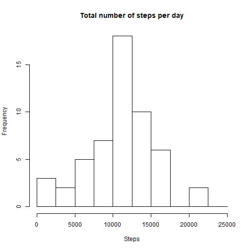
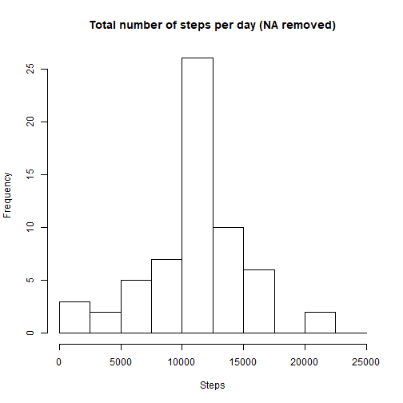
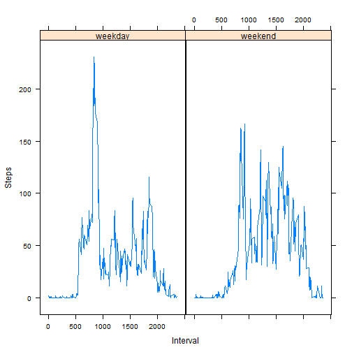

#Activity Monitoring Data Analysis - Report  
  
##Loading and preprocessing the data  
  
    
This data analysis was performed using RStudio.  
First of all, the data was loaded into R and all packages necessary for the analysis were loaded into R. 
  
   

```r
data<-read.csv("activity.csv")
library(dplyr)
library(lattice)
```
 
    
The data were then preprocessed to allow for exploratory data analysis. To this 
end, the data were separated according to the date variable, using the group_by function of the dplyr package, and stored in a new table named "split_data". The total number of steps per day was then calculated using the summarise function and the results stored in the "total" table.  
  
  

```r
split_data<-group_by(data,date)
total<-summarise(split_data,steps=sum(steps))
```
  
  
##What is mean total number of steps taken per day?  
  
  
The total number of steps per day was then visualized through a simple histogram.  
  
  

```r
hist(total$steps,main="Total number of steps per day",xlab="Steps",breaks=c(0,2500,5000,7500,10000,12500,15000,17500,20000,22500,25000))
```


  
  
The mean and median number of steps per day were calculated using simple functions.  
  
  

```r
mean(total$steps,na.rm=TRUE)
```

```
## [1] 10766.19
```

```r
median(total$steps,na.rm=TRUE)
```

```
## [1] 10765
```
  
  
The mean number of total steps taken per day is 10766.19 and the median value is very close to this one, at 10765.  
  
  
##What is the average daily activity pattern?  
  
  
To evaluate the average daily activity pattern, the number of steps taken for each 5-minute interval across all days of data collection was averaged, using the dplyr package in a similar fashion as before, only separating the data according to the interval variable this time. The resulting "average" table was then used to produce a time series plot. The 835th 5-minute interval contains, on average, the highest number of steps, with approximately 206 steps.  
  
  

```r
split_data2<-group_by(data,interval)
average<-summarise(split_data2,average=mean(steps,na.rm=TRUE))
plot(average$interval,average$average,type="l",xlab="Interval",ylab="Steps")
```


```r
average[average$average==max(average$average,na.rm=TRUE),]
```

```
## # A tibble: 1 x 2
##   interval average
##      <int>   <dbl>
## 1      835    206.
```
  
  
##Imputing missing values  
  
  
The dataset includes 2304 missing values for the number of steps taken.  
  
  

```r
length(which(is.na(data$steps))==TRUE)
```

```
## [1] 2304
```
  
  
Since the presence of missing values may introduce bias into certain summaries and calculations of the data, a new data table "new_table" where all missing values were replaced was generated. All missing values were found and replaced by their corresponding 5-minute interval average value.  
  
  

```r
new_data<-read.csv("activity.csv")
for(i in 1:length(new_data$steps)){
       if(is.na(new_data$steps[i]==TRUE)){
              new_data$steps[i]<-average$average[average$interval==new_data$interval[i]]
       }
}
```
  
  
The preprocessing of the data and exploratory data analysis was then repeated using this new dataset. The input of missing values using the chosen method does not affect the mean, only the median values, which is now similar to the mean (10766.19), unlike what was observed during the first attempt at this analysis.  
  
  

```r
new_split_data<-group_by(new_data,date)
new_total<-summarise(new_split_data,steps=sum(steps))
hist(new_total$steps,main="Total number of steps per day (NA removed)",xlab="Steps",breaks=c(0,2500,5000,7500,10000,12500,15000,17500,20000,22500,25000))
```



```r
mean(new_total$steps)
```

```
## [1] 10766.19
```

```r
median(new_total$steps)
```

```
## [1] 10766.19
```
  
  
##Are there differences in activity patterns between weekdays and weekends?  
  
  
To explore the differences between activity patterns among weekends and weekdays, a new factor variable ("weekdays") with two levels, "weekend" and "weekday", was created, stating wether the day of sampling was part of the weekend or not. The interval average data was summarized as before and the lattice system used to create two time series plots, with "weekdays" as the conditioning variable.  
  
  

```r
new_data<-mutate(new_data,weekdays=weekdays(as.POSIXlt(date)))
for(i in 1:length(new_data$weekdays)){
       if(new_data$weekdays[i]=="sábado"|new_data$weekdays[i]=="domingo"){
              new_data$weekdays[i]<-"weekend"
       }else{
              new_data$weekdays[i]<-"weekday"
       }
}
new_data$weekdays<-as.factor(new_data$weekdays)
new_split_data2<-group_by(new_data,weekdays,interval)
new_average<-summarise(new_split_data2,average=mean(steps))
xyplot(average~interval|weekdays,new_average,type="l",ylab="Steps",xlab="Interval")
```


  
  
As observable in the time series plots, the activity pattern is quite different, with the number of steps taken more evenly spread out over time on weekends.  
  
  

